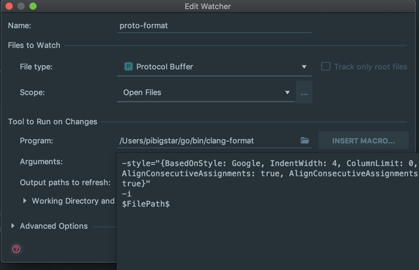

# 格式化proto

1. 下载clang-format
> brew install clang-format

2. 配置goland file watch

> -style="{BasedOnStyle: Google, IndentWidth: 4, ColumnLimit: 0, AlignConsecutiveAssignments: true, AlignConsecutiveAssignments: true}" -i $FilePath$